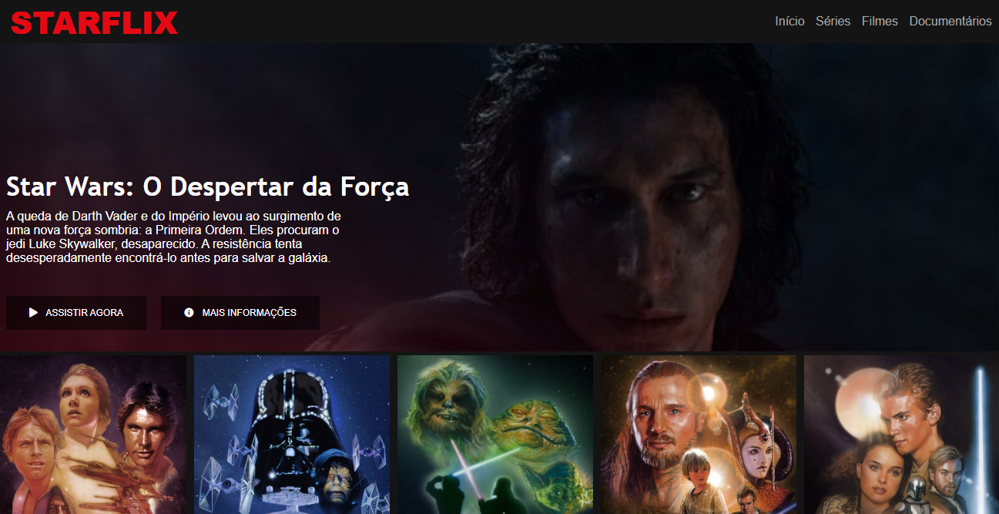
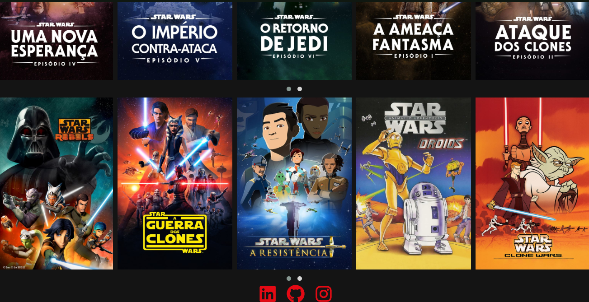

<h1 align="center">StarFlix</h1>
<h2 align="center">O clone da NetFlix, mas apenas sobre Star Wars</h2>

   <h3>Protejo do clone da NetFlix o StarFlix, tendo como proposta aprender os conceitos de boas práticas do:
        
        
        .  
    Proposto pelo Bootcamp da DIO como desafio, criar um clone a sua maneira utilizando essas tecnologias para desenvolver o STARFLIX !
   </h3>

    <h1 align="center">Site com a tela interia</h1>
  
   

##
 
 

  <h1>Click aqui para acessar o site hospedado no GitHub Pages: <a href="https://ricardosantanaevangelista.github.io/Clone-Netflix/">Site</a></h1>

 

  

